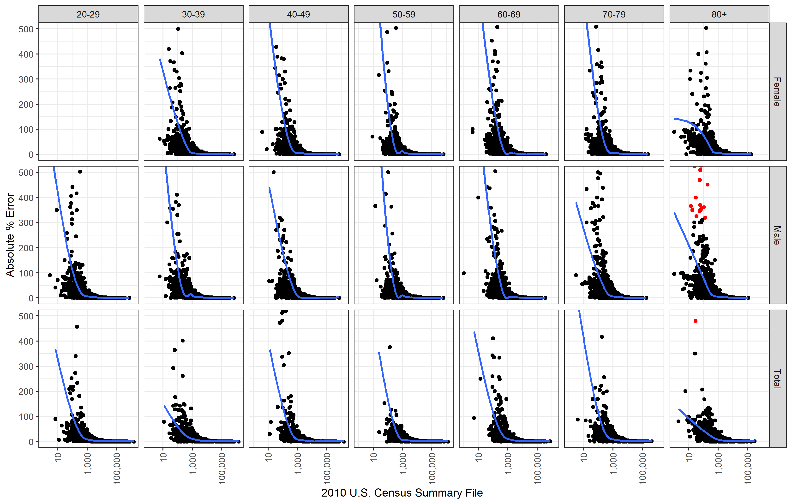

# Differential privacy in the 2020 Census will distort COVID-19 rates

# Introduction
Here we provide the data and code for:  [**Differential privacy in the 2020 Census will distort COVID-19 rates**](http://github.com/mathewhauer/covid-differential-privacy/blob/master/MANUSCRIPT/MainDocument.pdf)

### Citation

> Hauer, M.E. & Santos-Lozada, A.R. *Great Journal* (DOI Forthcoming) (YEAR ACCESSED).

# Abstract
> Scientists and policy makers rely on accurate population and mortality data to inform efforts regarding the coronavirus disease 2019 (COVID-19) pandemic, with age-specific mortality rates of high importance due to the concentration of COVID-19 deaths at older ages. Population counts – the principal denominators for calculating age-specific mortality rates – will be subject to noise injection in the United States with the 2020 Census via differential privacy. Using COVID-19 mortality curves from Italy, we show that differential privacy will introduce significant distortion in COVID-19 mortality rates – sometimes causing mortality rates to exceed 100% -- hindering our ability to understand the pandemic. This distortion is particularly large for population groupings with fewer than 1000 persons – 40% of all county-level age-sex groupings and 60% of race groupings. The US Census Bureau should consider a larger privacy budget and data users should consider pooling data to increase population sizes to minimize differential privacy’s distortion.

We show only those county age-sex groups with less than 500% error. Red dots correspond to county age-sex groups with mortality rates that impossibly exceed 1.0.

To see all of the underlying code and the results, [click here](http://htmlpreview.github.io/?https://raw.githubusercontent.com/mathewhauer/covid-differential-privacy/master/MANUSCRIPT/Reproduction.html?token=AD7TDMOKFTUASWG5HUOOGSS7CYW3G)

# Organization
- `/R/SCRIPTS/`  — Scripts and output for figures included in the main document.
- `/R/DATA-RAW/`  — Initial data resources, unprocessed.
- `/R/DATA-PROCESSED/` — Post-processed data for our analysis.

- `/MANUSCRIPT/reproduce.Rmd` — contains a replication for underlying estimates.

# Use
- Feel free to create a new branch for further incorporation and analysis. 

# Correspondence
For any issues with the functionality of these scripts please [create an issue](https://github.com/mathewhauer/covid-differential-privacy/issues).

## License
The data collected and presented is licensed under the [Creative Commons Attribution 3.0 license](http://creativecommons.org/licenses/by/3.0/us/deed.en_US), and the underlying code used to format, analyze and display that content is licensed under the [MIT license](http://opensource.org/licenses/mit-license.php).